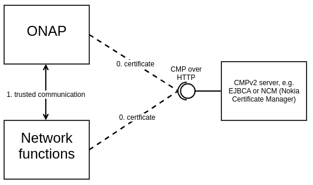

.. This work is licensed under a Creative Commons Attribution 4.0 International License.
.. http://creativecommons.org/licenses/by/4.0
.. Copyright 2020 NOKIA
.. _introduction:

Introduction
============

Overview
--------
The goal of this requirement is to implement new micro-service called CertService which will request certificates signed by external Certificate Authority (CA) using CMP over HTTP protocol. Uses CMPv2 client to send and receive CMPv2 messages.

CertService's client will be also provided so other ONAP components (aka end components) can easily get certificate from CertService. End component is an ONAP component (e.g. DCAE collector or controller) which requires certificate from CMPv2 server to protect external traffic and uses CertService's client to get it.

CertService's client communicates with CertService via REST API over HTTPS, while CertService with CMPv2 server via CMP over HTTP.

To proof that CertService works Open Source CMPv2 server (EJBCA) will be deployed and used in E2E tests.

It is planned that Network Functions (aka xNFs) will get certificates from the same CMPv2 server and the same CA hierarchy, but will use own means to get such certificates. Cause xNFs and ONAP will get certificates signed by the same root CA and will trust such root CA, both parties will automatically trust each other and can communicate with each other.

Context View
------------

